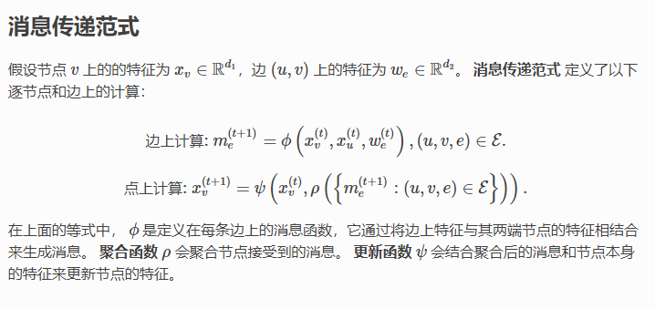

# DGL

## task list
- [x] debug new_gcn 
- [ ] read EnGNN
- [x] read dgl interface and example and read gin.
- [x] translate GoG graph into New-gcn 
    - [x] read scipy interface
    - [x] load the graph into scipy and write the .graph
    - [x] add to server and add to the script for downloading.
- [x] install the cuda-10.2 environment

---
- [DGL](#dgl)
  - [task list](#task-list)
  - [data struct: class RedditDataset(DGLBuiltinDataset):](#data-struct-class-redditdatasetdglbuiltindataset)
  - [data struct:DGLHeteroGraph](#data-structdglheterograph)
  - [graph functions:](#graph-functions)
  - [scipy sp](#scipy-sp)
  - [install cuda10 envirionment](#install-cuda10-envirionment)
## data struct: class RedditDataset(DGLBuiltinDataset):
in examples/pytorch/graphsage/train_sampling.py:216,
it returns:
``` python
g, n_classes = load_reddit()
```
where:
``` python

def load_reddit():
    from dgl.data import RedditDataset

    # load reddit data
    data = RedditDataset(self_loop=True)
    g = data[0]
    g.ndata['features'] = g.ndata['feat']
    g.ndata['labels'] = g.ndata['label']
    return g, data.num_labels

```
data[0] represent the graph, which is from:
``` python
# graph
        coo_adj = sp.load_npz(os.path.join(
            self.raw_path, "reddit{}_graph.npz".format(self._self_loop_str)))
        self._graph = from_scipy(coo_adj)
```
the type of the graph is ***DGLHeteroGraph***

---

## data struct:DGLHeteroGraph
```python
"""Class for storing graph structure and node/edge feature data.

    There are a few ways to create a DGLGraph:

    * To create a homogeneous graph from Tensor data, use :func:`dgl.graph`.
    * To create a heterogeneous graph from Tensor data, use :func:`dgl.heterograph`.
    * To create a graph from other data sources, use ``dgl.*`` create ops. See
      :ref:`api-graph-create-ops`.

    Read the user guide chapter :ref:`guide-graph` for an in-depth explanation about its
    usage.
    """
```


相比同构图，异构图里可以有不同类型的节点和边。这些不同类型的节点和边具有独立的ID空间和特征。 例如在下图中，”用户”和”游戏”节点的ID都是从0开始的，而且两种节点具有不同的特征。
```python
import dgl
import torch as th
# 创建一个具有3种节点类型和3种边类型的异构图
graph_data = {
   ('drug', 'interacts', 'drug'): (th.tensor([0, 1]), th.tensor([1, 2])),
   ('drug', 'interacts', 'gene'): (th.tensor([0, 1]), th.tensor([2, 3])),
   ('drug', 'treats', 'disease'): (th.tensor([1]), th.tensor([2]))
}
g = dgl.heterograph(graph_data)
g.ntypes
g.etypes
g.canonical_etypes
```


---


## graph functions:

experiemtns:


apply edges: play edge update:
```python
from dgl import function as fn
import dgl
import torch
g=dgl.graph(([0,1,2,3],[1,2,3,4]))
g.ndata['h']=torch.ones(5,2)
#g.apply_edges(lambda edges:{'x':edges.src['h']+edges.dst['h']})
g.apply_edges(fn.u_add_v("h",'h','x'))
print(g.edata['x'])
```

update_all: propagate, reduction, and apply:

```python
from dgl import function as fn
import dgl
import torch
g=dgl.graph(([0,1,2,3,0],[1,2,3,4,2]))
g.ndata['h']=torch.ones(5,2)


g.update_all(fn.copy_u("h","m"),fn.sum("m","x"))
print(g.ndata['x'])

```


GIN model:
clss GIN:formard(self,g,h):g:graph,h
which contains the GraphConv layers and predict layers, the main problem is  how the dataset present

have a close look at the GIN_dataset, 
for the dataset, there are multiple subgraphs, and each subgraph have one lable, inside each graph, each node have a label. The key is here: how the model fetch the data inside the dataset.

have a close look at GIN_dataloader:
GIN_dataloader is simply two GraphDataLoader:
```python
class GraphDataLoader:
    def __init__(self, dataset, collate_fn=None, **kwargs):
        collator_kwargs = {}
        dataloader_kwargs = {}
        for k, v in kwargs.items():
            if k in self.collator_arglist:
                collator_kwargs[k] = v
            else:
                dataloader_kwargs[k] = v

        if collate_fn is None:
            self.collate = GraphCollator(**collator_kwargs).collate
        else:
            self.collate = collate_fn

        self.dataloader = DataLoader(dataset=dataset,
                                     collate_fn=self.collate,
                                     **dataloader_kwargs)

```

the collate defines how to combine the graphs inside a batch:
```python
    r"""Batch a collection of :class:`DGLGraph` s into one graph for more efficient
    graph computation.

    Each input graph becomes one disjoint component of the batched graph. The nodes
    and edges are relabeled to be disjoint segments:

    =================  =========  =================  ===  =========
                       graphs[0]  graphs[1]          ...  graphs[k]
    =================  =========  =================  ===  =========
    Original node ID   0 ~ N_0    0 ~ N_1            ...  0 ~ N_k
    New node ID        0 ~ N_0    N_0+1 ~ N_0+N_1+1  ...  1+\sum_{i=0}^{k-1} N_i ~
                                                          1+\sum_{i=0}^k N_i
    =================  =========  =================  ===  =========
```
So every time the data return a combined large graph like this.

now we can finally have a look at the model:

```python
#in main.py::eval:
        feat = graphs.ndata.pop('attr')
        #the shapre of feat is 590x7
        total += len(labels)
        outputs = net(graphs, feat)
        #the shapre of the outputs is 32,2
        _, predicted = torch.max(outputs.data, 1)
        #the shape of the predicted is 32,1
        total_correct += (predicted == labels.data).sum().item()
```

for this now, we can see when batch size is 32, the output will be 32 results.

now look at net.forward:
```python
# first go through the Ginlayers, and save each hidden layer,
        for i in range(self.num_layers - 1):
            h = self.ginlayers[i](g, h)
            h = self.batch_norms[i](h)
            h = F.relu(h)
            hidden_rep.append(h)
# then for each hidden layer, calculate the classification score and add them up:
        # perform pooling over all nodes in each graph in every layer
        for i, h in enumerate(hidden_rep):
            pooled_h = self.pool(g, h)
            score_over_layer += self.drop(self.linears_prediction[i](pooled_h))


```
The most important part here is the self.pool, it's different of general pool, it use read_out to combine each batch and formate into one graph's representation, in here, h's shape is 570x7, and pooled_h is 32_7, where 570 is the total nodes in this batch, and 32 is the batch size.


***overall conclusion of the GIN***: for each mini graph, it have a lable, and for each node in a graph, it have a lable and an "attr" we use the "attr" and the connection of the graph as input, calculate each hidden layer output, and use hidden layer to merge all reasult of the nodes into on graph representation. finnaly combine all hidder layer's predict result to form final result.

several operations in GIN:
- input: a large graph whicn combines multiple small graph, fro example:small graph:20x7,graph_num:10,large graph: 200x7.
- first for each layer,go througn ginlayer,batch_norms,and relu,save each layer's hidden rep,
- output: layer 1: 200x64,layer 2:200x64...
- next for each layer's hidden,use pool(g,h) to pool the graph, in GIN pool is same as read out, that's partially sum the big graph again into the small graphs,
  - there are three functions, look at the last one, it will get the batch num index and sum inside the index bound.
  - ```with graph.local_scope():
            graph.ndata['h'] = feat
            readout = sum_nodes(graph, 'h')
            return readout```
  - ```def sum_nodes(graph, feat, weight=None, *, ntype=None):

    return readout_nodes(graph, feat, weight, ntype=ntype, op='sum')
    ```

  - ```return segment.segment_reduce(graph.batch_num_nodes(ntype), x, reducer=op)```

- output: layer 1: 32x64,layer 2: 32x64
- finnaly, for each layer, use prediction layer to generate the label for each sub graph:
- output: layer 1: 32x2, layer2:32x2
- then output the sum of all the hidder layers
- output 1x2


---

## scipy sp
```python
import numpy as np
from scipy.sparse import csc_matrix
csc_matrix((3, 4), dtype=np.int8).toarray()

row = np.array([0, 2, 2, 0, 1, 2])
col = np.array([0, 0, 1, 2, 2, 2])
data = np.array([1, 2, 3, 4, 5, 6])
csc_matrix((data, (row, col)), shape=(3, 3)).toarray()

indptr = np.array([0, 2, 3, 6])
indices = np.array([0, 2, 2, 0, 1, 2])
data = np.array([1, 2, 3, 4, 5, 6])
csc_matrix((data, indices, indptr), shape=(3, 3)).toarray()

```

## install cuda10 envirionment
```shell
conda create -n dgl_cuda
conda activate dgl_cuda
conda install pytorch torchvision torchaudio cudatoolkit=10.2 -c pytorch
conda install -c dglteam dgl-cuda10.2
pip install --upgrade tensorflow
```